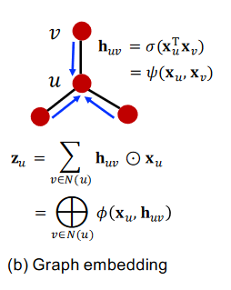
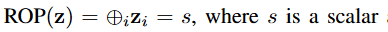
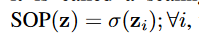
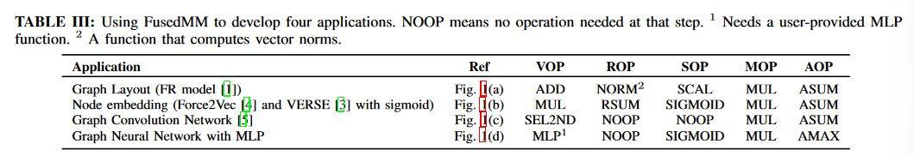
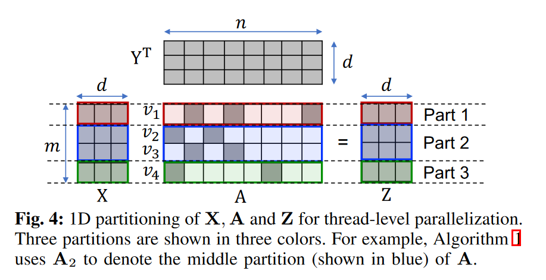
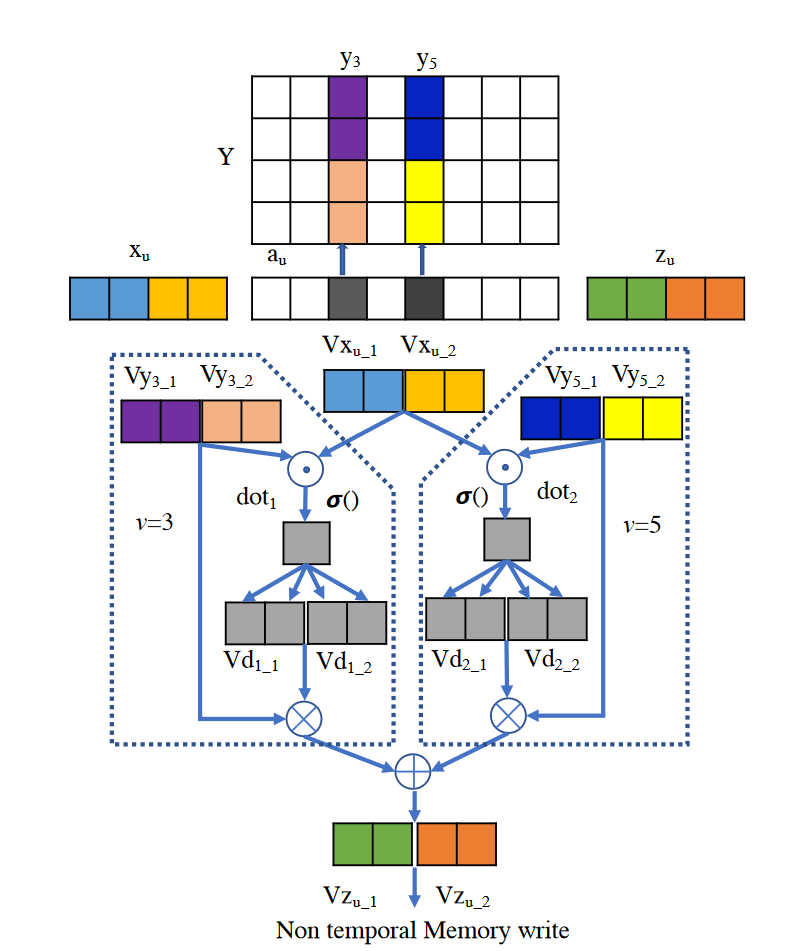

# FusedMM

Contribution:

* code：https://github.com/HipGraph/FusedMM

* We integrated FusedMM with DGL and show that even a naive implementation of FusedMM is always faster than DGL’s SDDMM and SpMM operations on Intel, AMD and ARM processors.(没有GPU implement)

## SDDMM + Spmm

GNN中常见的计算pattern：SDDMM + Spmm
$$
H=(X@Y^T)*A\\
Z=H@Y
$$

## The need for fused kernel

motivation: reduce memory requirement

intermediate value: $Mem(H)=O(d*E)$ with d-dim messages on edges

## Kernel design

提出了一套可以归纳GNN模型计算流的五个op（没有softmax）

take graph embedding as example

前三步：计算$h_{uv}$

1. VOP: perform elementwise op on $x$ and $y$ $VOP(x,y) = x*y$

2. ROP: reduce vector into scalar

   

3. SOP: scales a vector/scalar using a linear or nonlinear function.

   

4. MOP

5. AOP

### Thread-level parallel

Partition key objectives：

* different parts are independent with each other, so that threads in different parts can process in parallel with sync.
* the computation overhead for each partition should be approximately equal.

FusedMM采用了1D的partition，且由于A的不同行非零值数量差别很大，不同part负责的行数不同（load-balance scheme）

## code flow

