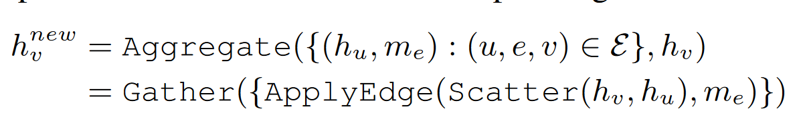

# UNDERSTANDING GNN COMPUTATIONAL GRAPH

Ref: http://arxiv.org/abs/2110.09524

## GNN operator

Update node feature

Update edge feature

## Design overview

论文中针对GAT提出了一系列优化：

propagation postponed reorganization： 把linear放到propagate之前

unified thread mapping

Intermediate data recomputation: forward时不保存intermediate data

## propagation postponed reorganization： reduce compute

原始的GAT在edge上做linear，会造成很多冗余的计算

### identify redundancy

此种冗余一般发生在 Scatter+apply-edge阶段

**判断方法：**

if the Scatter function g and ApplyEdge function φ follows the commutative law and distributive law

即 $\phi\left(g\left(v_1, v_2\right)\right)$是否等于$g\left(\phi\left(v_1\right), \phi\left(v_2\right)\right)$

**解决方法：**

reorder Scatter-ApplyEdge to ApplyVertex-Scatter

**Eg: GAT** 估计计算开销

**优化前**

* concat: $2|E|f$
* linear: $4|E|f$
* LeakyRelu: $|E|$

total $6|E|f+|E|$

**优化后**
$$
\begin{aligned}
\text{For each node u } e_u^l&=a_l^T h_u\\
e_u^r&=a_r^T h_u\\

\text{For each edge uv } e_{uv}& = \text{relu}(e_u^l+e_v^r)
\end{aligned}
$$
total $4|V|f+2|E|$

## Unified thread mapping: reduce IO

diverged thread-mapping in diff op

* edge centric op
* node centric op

different thread-mapping schemes

* vertex-balanced
* edge-balanced

比方说在Gather操作下使用edge balance策略，需要使用原子操作

### Approach

fuse all graph-related operators with unified thread mapping， 对于所有的op采用相同的thread mapping策略

## Intermediate data recomputed: reduce memory

Eg:

对于一个scatter+gather操作，在前向时如果把它fuse成一个kernel，就能把O(|E|) 的数据存在on-chip mem而非off-chip mem，但由于我们在后向中需要这个数据，我们又只能将其在off chip mem中保存。

### Insight

if the intermediate data is memory consuming but light weight to compute, we can recompute those needed intermediate data during backward

### Approach

fuse+recompute

fuse: reduce the data movement and launch overhead

recompute: reduce the memory consumption
