## GNN sample paradigms

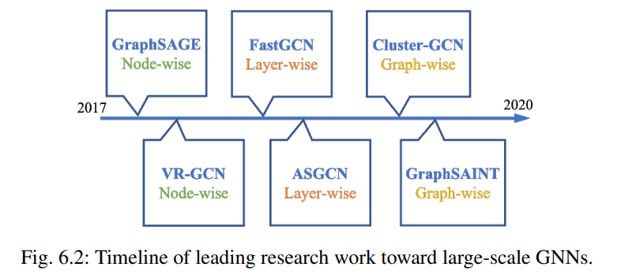

### Node-wise Sample

GraphSage

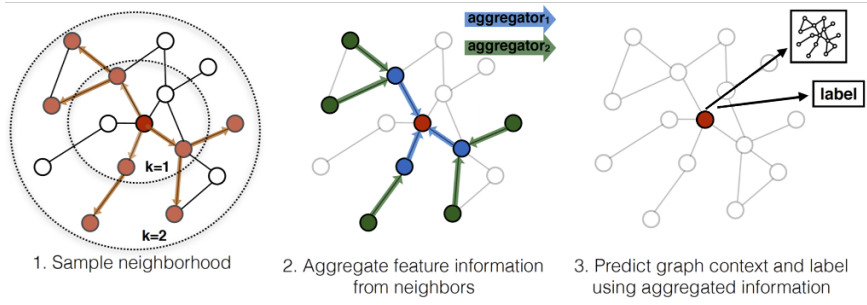
$$
h_{\mathcal{N}(v)}^k\leftarrow AGGREGATE_k({h_u^{k-1}, \forall u \in \mathcal{N}(v)})\\
h_v^k \leftarrow \sigma (W^k \cdot  COMBINE(h_v^{k-1}, h_{\mathcal{N}(v)}^k))
$$

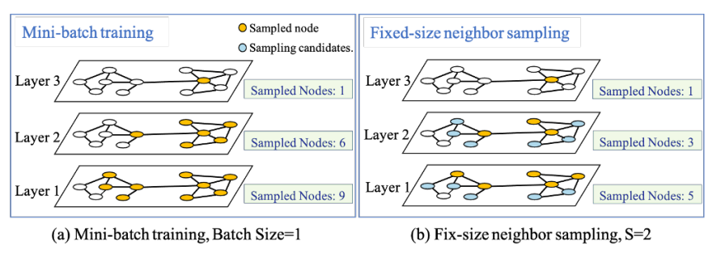

VR-GCN

通过历史嵌入向量来减少每一层需要采样的节点数

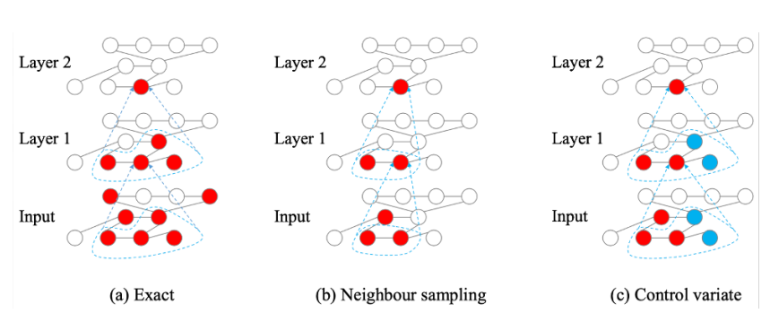

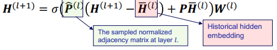

缺点：需要额外的内存来存储所有的历史隐藏嵌入，难以实现大规模扩展。

### Layer-wise Sample

引入不同节点的采样权重，在每层采样固定数量的节点

FastGCN

提出了基于重要度的采样模式，从而降低方差。在采样过程中，每一层的采样都是相互独立的，而且每一层的节点采样概率也保持一致。

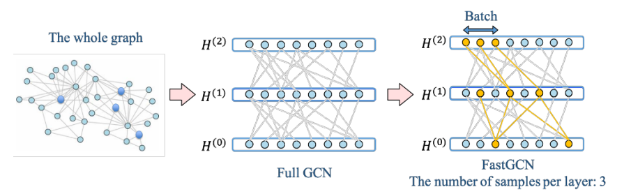

ASGCN

Only samples nodes from the neighbors of the sampled node (yellow node) to obtain the better between-layer correlations, while FastGCN utilizes the importance sampling among all the nodes

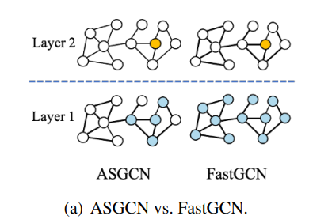

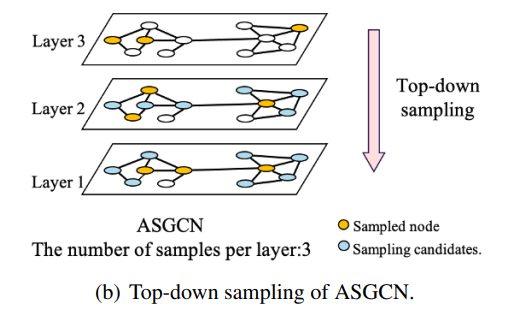

### Graph-wise Sample

cluster-GCN

首先使用图分割算法将图分解为更小的子图，然后在子图层面上组成随机的分批，再将其输入 GNN 模型，从而降单次计算需求。

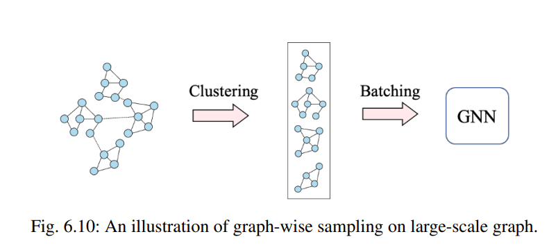

对于cluster-GCN，它只采样子图内的节点

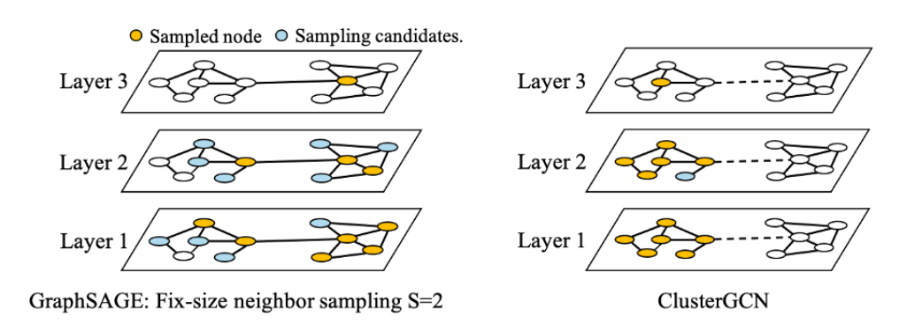

Two problem：

* The links between sub-graphs are dismissed, which may fail to capture important correlations. 
* Clustering algorithm may change the original distribution of the dataset and introduce some bias.
* Solution: randomly combine some clusters(include the edges between clusters)

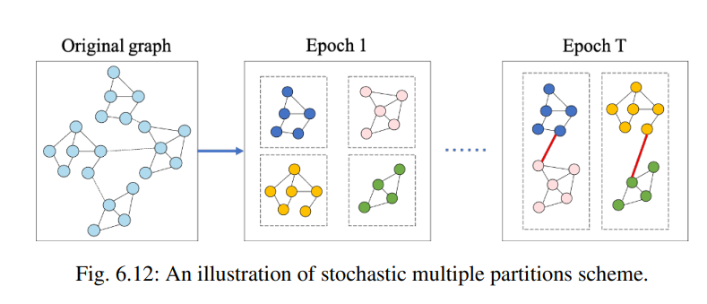

### Large-scale Graph Neural Networks on Recommendation Systems

**Application**

* item-item recommendation 
* user-item recommendation

#### item-item recommendation 

PinSage (第一次将GCN应用于工业级推荐系统的图算法,类似于GraphSage)

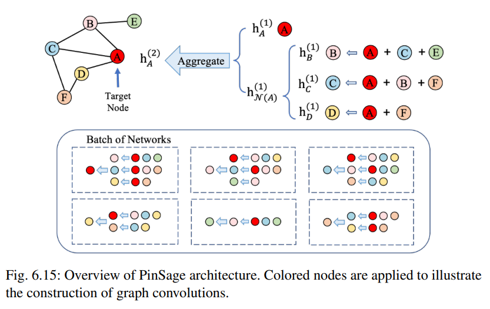

计算节点特征：从邻居节点聚合

* 从邻居节点经过dense层生成$n_u$
* 聚合$z_u,n_u$生成新的节点特征

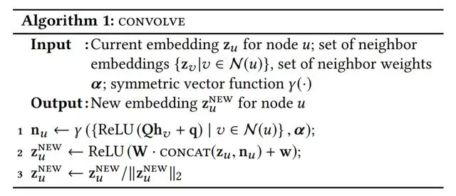

我们希望负样本嵌入间的内积小于正样本嵌入间的内积，并且差值尽量大于某一阈值。对于节点$z_q, z_i$之间的loss，定义为

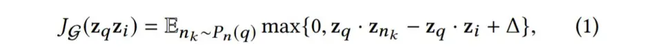

其中$n_k$为负样本，$\Delta $ 为超参数即阈值

#### user-item recommendation

IntentGC

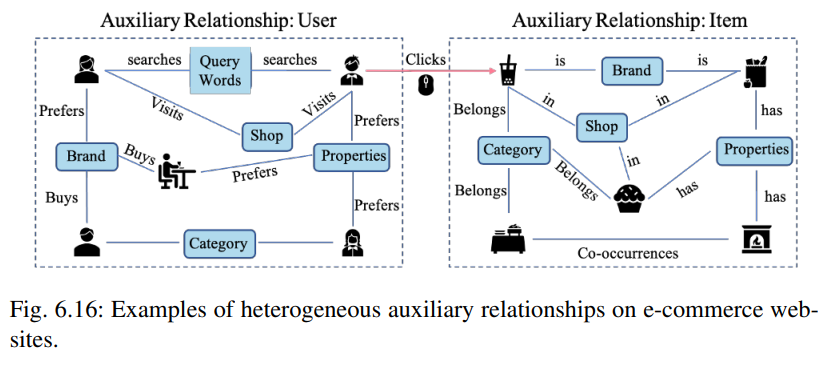

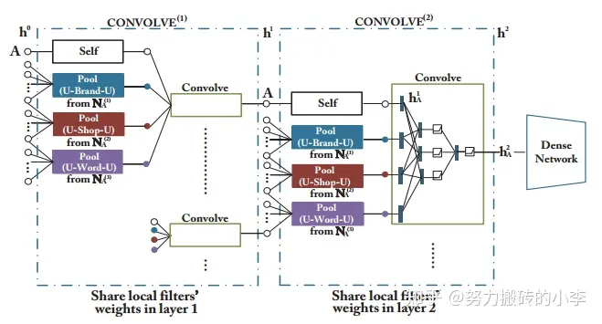
