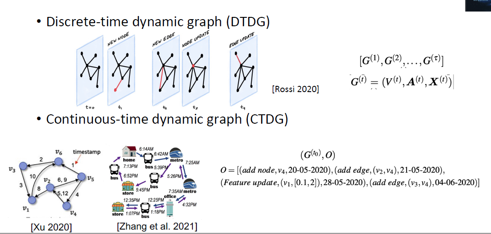
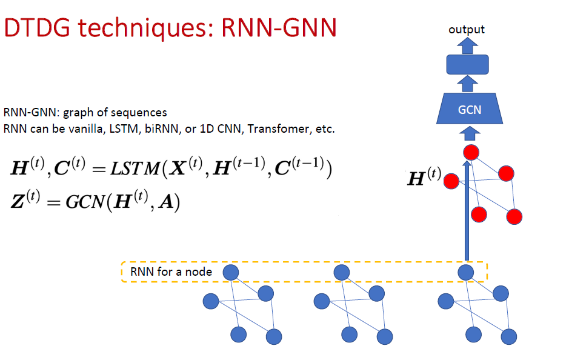
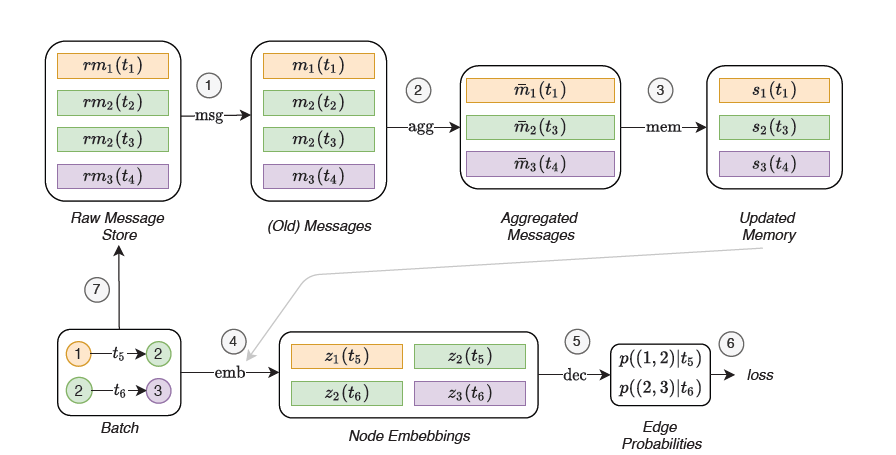

# Dynamic Graph

## Two dynamic graph types (diff?)

Operations of graph dynamics:
- Node addition/deletion
- Feature update
- edge addition/deletion
- edge weight updates

## Task types

-  Dynamic Node classification/regression
-  Dynamic graph classification
-  Dynamic link prediction
-  Time prediction

## RNN-GNN(TGN)

TGN network arch

## Future directions

-  Node addition and removal are still challenges.
-  Inverse problem of graph dynamics
-  Spatiotemporal