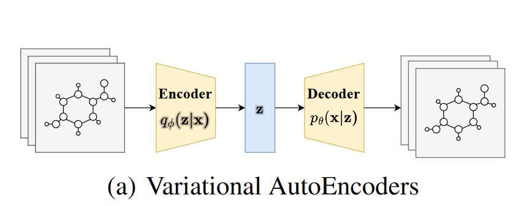
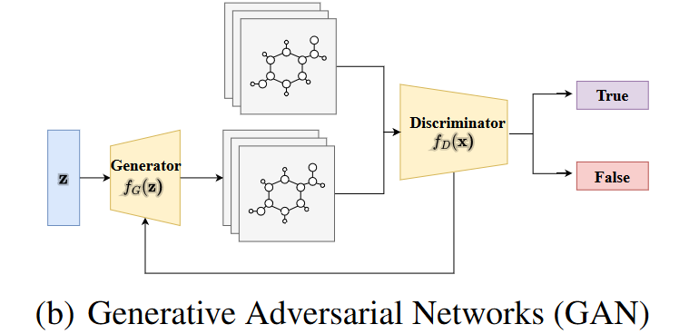
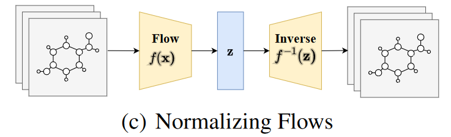
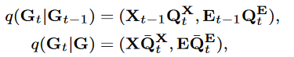
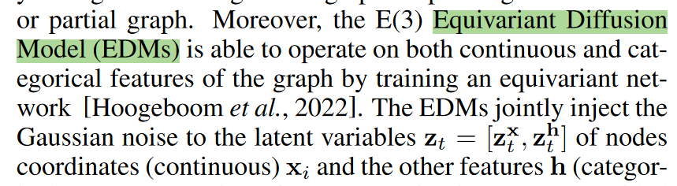
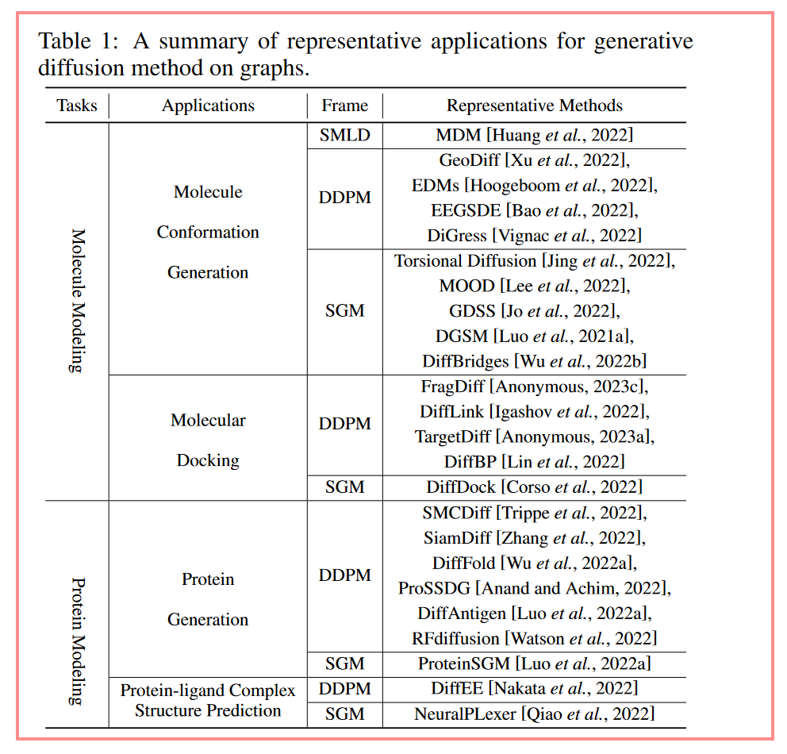

# Generative Diffusion Models on Graphs

## Challenge

* Discreteness: hard to introduce straightforward back-propagation training
* Complex Intrinsic Dependencies
* Permutation Invariant: at most N ! different equivalent adjacency matrices representing the same graph with N node

## Related works

Variational Autoencoders (VAEs)

Generative Adversarial Networks (GAN)

Normalizing Flows

## Diffusion models

* Score Matching with Langevin Dynamics (SMLD)
* Denoising Diffusion Probabilistic Model (DDPM)
* Score-based Generative Model (SGM)

### DDPM on Graphs

#### DiGress (ICML 2023)

Digress: Discrete denoising diffusion for graph generation.

DiGress [Vignac et al., 2022] extends the DDPM algorithm to generate graphs with categorical node and edge attributes. The conditional probabilities for the noisy graphs can be defined as follows:

where Gt = (Xt, Et) refers to the noisy graph composed of the node feature matrix Xt and the edge attribute tensor Et at step t. QtX and QtE refer to the noise added to the node and edge, respectively. This Markov formulation allows sampling directly at an arbitrary time step without computing the previous steps. In the denoising process, DiGress incorporates the cross-entropy to evaluate the distance between the predicted distribution and the input graph distribution with respect to node and edge, so as to train the parameterized graph transformer network φθ. Thus, the modeling of graph distribution is simplified to a sequence of classification.

### EDM (ICML 2022) 

Equivariant diffusion for molecule generation in 3d.

## Application

## Future challenge

* Discrete Nature of Graphs

* Conditional Generation for Graph Diffusion Models

* Trustworthiness for Graph Diffusion Models

* Evaluation Metrics

* **Graph Diffusion Applications**

  * Recommender system

    As users’ online behaviors towards items can be naturally represented as graph-structured data, graph learning techniques have been successfully used to capture users’ preferences towards items (i.e., distributions)

    **Graph neural networks in recommender systems: a survey.**