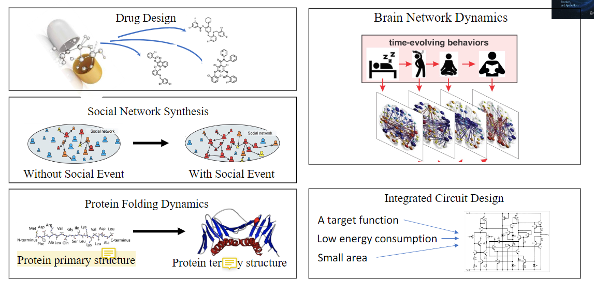
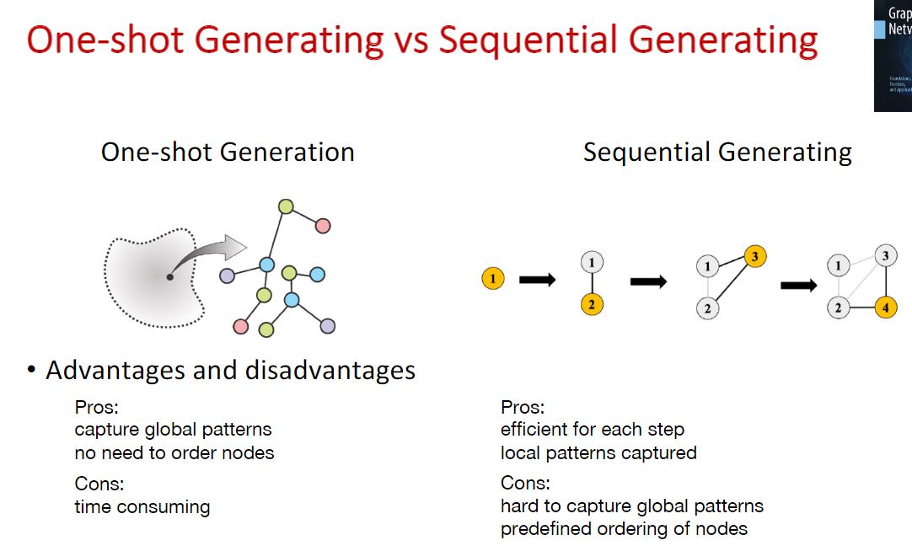

# Graph Generation Application
## Application

Two main methods: 

* One-shot generation
* Sequential generation

#### GraphVAE(One-shot generation)

* Encoder: GNN graph to vector 

* Decoder(generator): MLP vector to A E F (graph)

## Graph Translation

### GT-GAN

GT-GANs learn a conditional generative model, which is a graph translator that is conditioned on input graph and generate the associated target graph.

Aim at translating a graph with one modality to a new one with other modality using deep neural networks architecture. Eg: Examples include generating the traffic jam situation given a road network without traffic jam.

* Graph translator
  * Encoder + decoder 
* Conditional graph discriminator

## Benchmark dataset

### GraphGT

## Future Opportunities

* Scalability.
* Validity constraint
* Interpretability and Controllability.