# Graph Matching

## Graph Matching Application

* Graph similar searching in graph based database
* 3D Action Recognition
* Unknown malware(恶意代码) detection 

## Problem Formulation

Given a set of $m$ graph instances $\mathcal{G}=\{G^1,G^2,\dots,G^m\}$, we aim to learn a mapping $d:G*G\rightarrow R$, mapping $d(·, ·)$ should also maintain the basic distance metric properties, i.e., nonnegativity, identity of indiscernibles, symmetry and triangle inequality.

### Node Correspondence

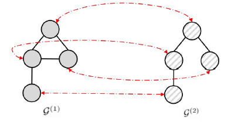

Find a node-to-node correspondence matrix between two graphs.

* NP-hard
* Computationally expensive and Poor scalability

### Similarity Learning

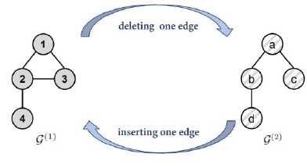

Produce a similarity score between two graphs, usually use **GED (Graph edit distance) and MCS (Most common subgraph)**

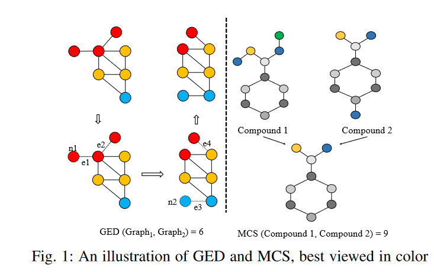

* NP-hard
* GNN-based methods demonstrating superiority over traditional methods

## Graph Similarity Learning methods

### Convolutional  Set Matching

GraphSim(Bai et al, 2020b): 

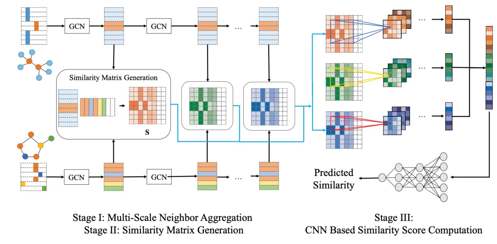

* 节点间的顺序是怎么确定的？BFS

* 在得到相似度矩阵后怎么操作？类似于CNN(卷积、池化啥的)

### Hierarchical clustering

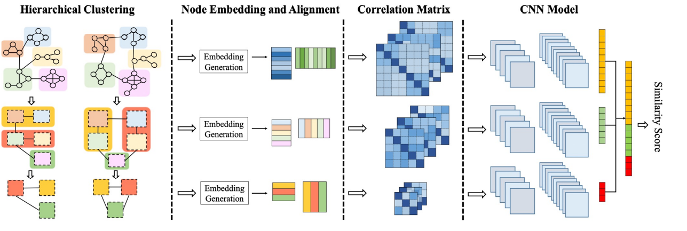

Hierarchical graph matching network (HGMN) (Xiu et al, 2020)

Motivation:  two similar graphs should also be similar when they are compressed into more compact graphs.

**HGMN fundamental difference:**

* Use multiple stages of spectral clustering to create a multi-scale view of the similarity betw een graphs
* Align the nodes in the two graphs using the earth mover distance and computes correlation matrix in the aligned order.

### Graph-Bert

亮点：提出了一种计算graph-pair distance metric的方案，引入了semi-supervised，同时计算时考虑了metric的基本性质

GB-DISTANCE (Zhang, 2020)

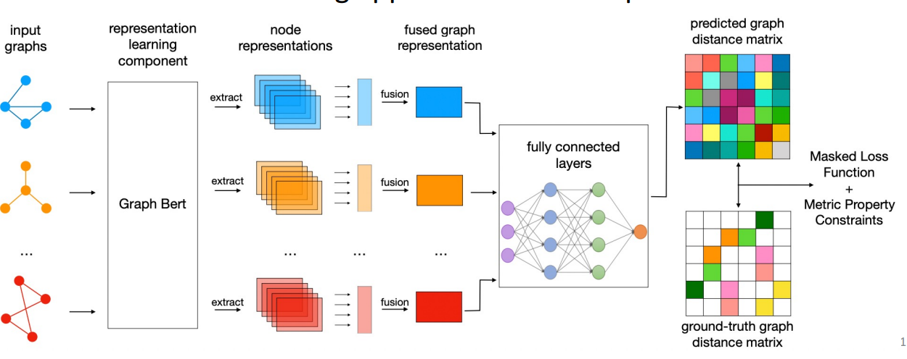

Motivation: learn the distance metric of the graph instances, it is the foundation of many other research tasks, e.g., molecular graph clustering, brain graph classification and frequent sub-graph extraction

#### The common disadvantage of graph match model

* High computational cost: train cost will grow quadratically as graph number increases. the pair is $\frac{n(n-1)}{2}$
* Node-Order Invariant representation
  *  learned graph instance representations and the distance metric scores will vary greatly as the input graph node order changes
  *  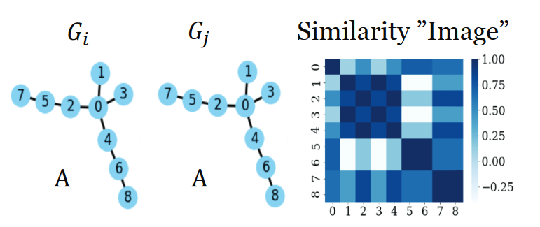
* Semi-supervised learning
  * The graph-pair distance scores need to be labeled, tedious and time-consuming.

* Lack of metric properties

#### Framework

##### Graph representation gen: Graph-Bert + fusion

For node $v_i$, initial input embedding is 

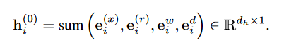

Which pre-computed WL code as $WL(v_i)\in N$, $w_i=[w(v_i,v_j)]_{v_j\in v}\in R^{|V|*1}$, $D(v_i) ∈ N$ is the degree of $v_i$.
$$
e_i^x=Embed(x_i)\in R^{d_h*1}
$$

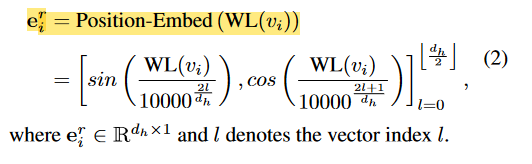

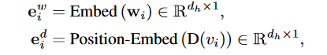

After init, we can get $H$: the all node representations

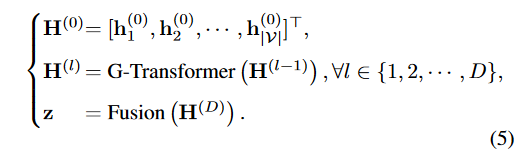

**G-Transformer:**

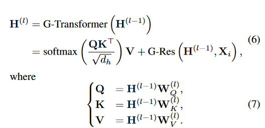

$z$ is the mean of all node representation in a graph 

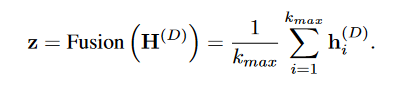

##### Distance metric and loss

The distance between two graphs:

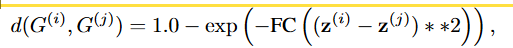

* non-negative
* normal range [0,1]
* d=0 for the same $z$

then we can get matrix $D, D(i,j)=d(G^{(i)},G^{(j)})$

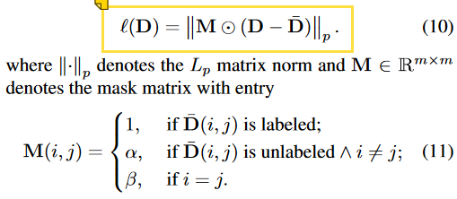

which $\alpha\in[0,1]$ is hyper-parameter, $\beta$ is a large number.

### Cross-graph  Matching

Graph Matching Networks (GMN) (Li et al, 2020)

Two models for graph similarity learning: **graph embedding/matching network**

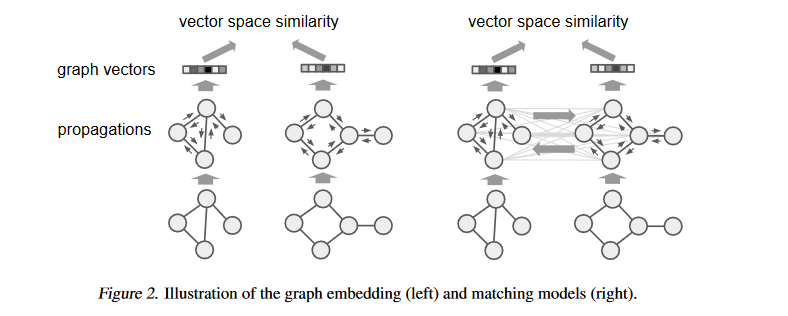

#### Graph embedding models (traditional GNN)

Generate node representation

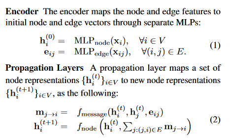

Aggregation to graph representation

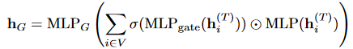

Complexity: $O(|V|+|E|)$

#### GMN (Graph Matching Network)

Given two graphs $G_1 = (V_1, E_1)$ and $G_2 = (V_2, E_2)$ , produces the similarity score $s(G_1, G_2)$

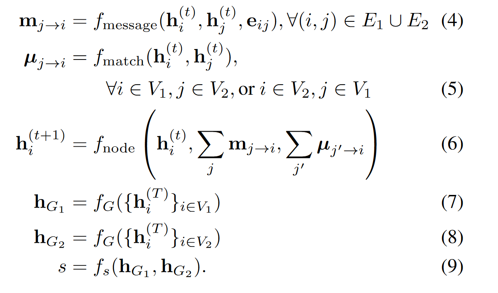

$f_{match}$ is a function that communicates cross graph information

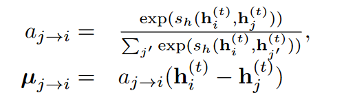

Complexity: $O(|V_1||V_2|)$

##### Loss

**Pairwise training**: requires a dataset of pairs labeled as positive (similar) or negative (dissimilar)

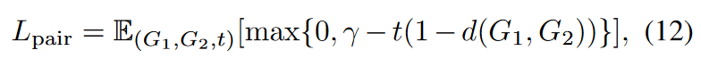

where $t ∈ \{−1, 1\}$ is the label for this pair, $γ > 0$ is a margin parameter, and $d(G_1, G_2) = ‖h_{G_1} − h_{G_2} ‖^2$ is the Euclidean distance. This loss encourages $d(G_1, G_2) < 1−γ$ when the pair is similar $(t = 1)$, and $d(G_1, G_2) > 1+γ$ when $t = −1$.

**Triplet training**: 

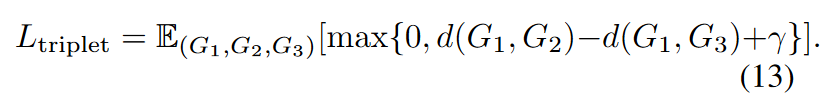