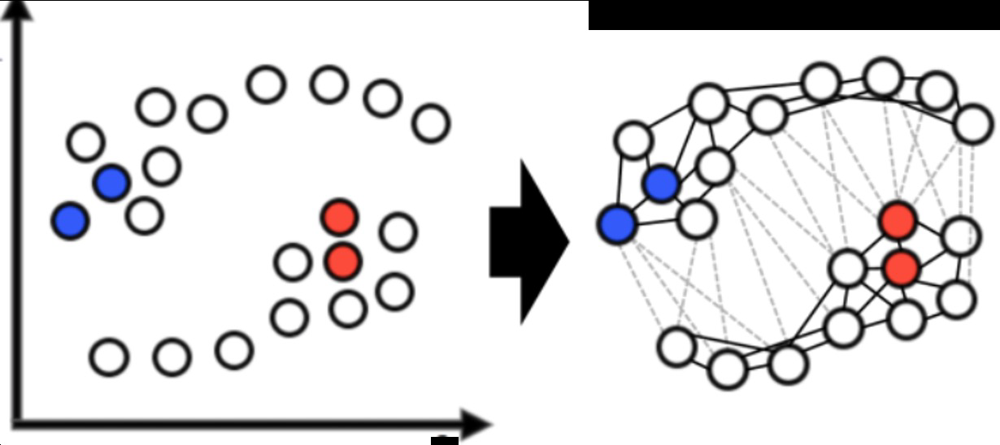
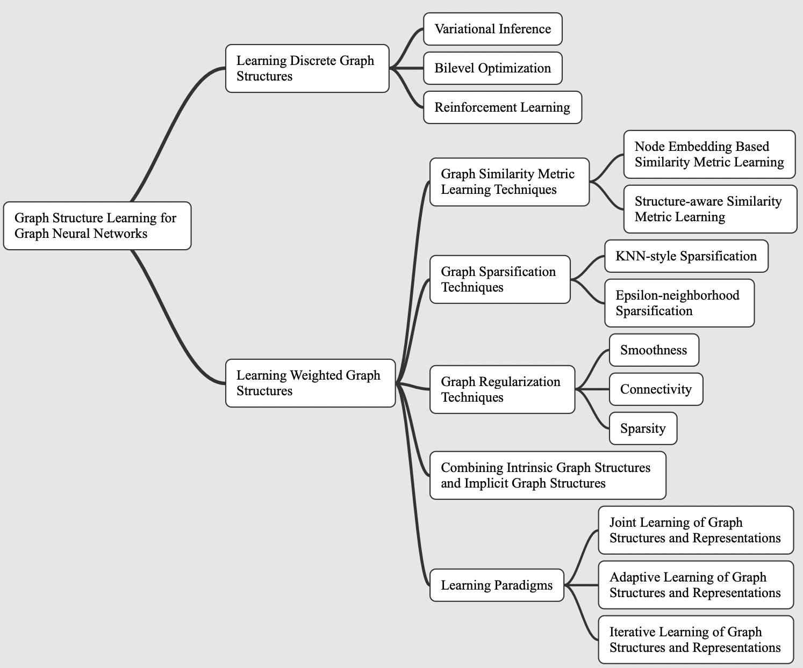

# Graph Structure Learning

## Motivation

* GNNs requires graph-structured data available.
* The real-word graph topology is often noisy or incomplete

* Many applications (e.g., NLP tasks) may only have non-graph structured data or
  even just the original feature matrix, requiring additional graph construction.
* **Aim:** discover useful graph structures from data for better graph representation learning with GNNs.

## Methods

* Learning Discrete Graph Structures

* Learning Weighted Graph Structures

  