# GNN at the Edge: Cost-Efficient Graph Neural Network Processing over Distributed Edge Servers

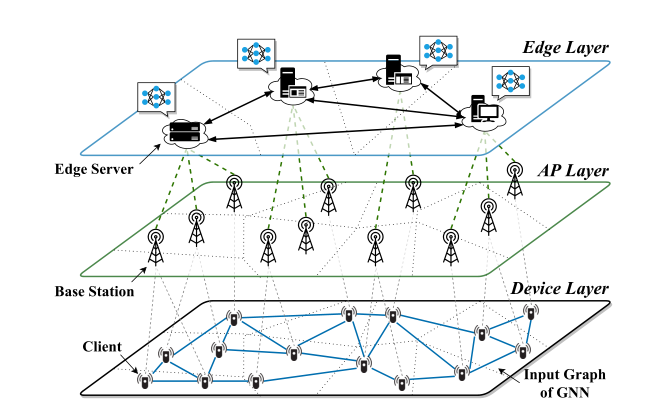

A multi-tier edge network architecture comprising device layer, access point (AP) layer, and edge layer. The clients with connections form a data graph (e.g., social web), while each node in the edge network covers a range of users. 

The edge servers perform distributed GNN processing by parallelizing model execution and exchanging data mutually,

Motivation: reduce the whole cost of the system

study the system cost optimization problem for Distributed GNN Processing over heterogeneous Edge servers (DGPE) by building a novel modeling framework that generalizes to a wide variety of cost factors.

* data collection
* GNN computation
* cross-edge data exchanging,
* edge server maintenance.

propose GLAD, a novel Graph LAyout scheDuling solution framework that can optimize the system cost for different GNN inference scenarios.

## System model

Edge servers are geographically distributed in different areas and clients have their data individually collected from certain access points (Client位置固定)

1) the edge network that hosts distributed model execution
2) the data graph formed by clients’ associated data, which feeds the GNN model as the input graph. 

### Edge network

edge network $T = (D, W)$，use $W =\{w_{ij}|i, j ∈ D\}$ to characterize their connectivity
where $w_{ij} = 1$ if the edge servers $i$ and $j$ are mutually accessible 

### Data graph

data graph $G = (V, E),$ where the clients contribute as data points in $V$ and $E = \{e_{vu}|v, u ∈ V\}$ indicates their topology. Specifically, $e_{vu} = 1$ if two clients $v$ and $u$ have links in G

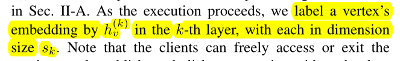

### Graph layout

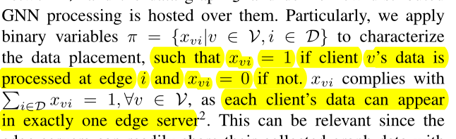

**Tuning graph layout can thus effectively optimize distributed GNN processing**: by navigating data streams of clients to proper edge servers, we can jointly minimize system cost in terms of data collection, GNN computation, cross-edge traffic, and edge server maintenance. 

## Cost factor

### Data collection

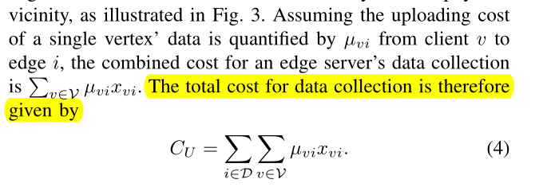

### GNN computation

GNN model consists of aggregation and update steps.

the computation cost of aggregation can be calculated in $α|N_v|s_{k−1}$. 

the cost of update is $βs_{k−1}s_k + γ_sk$

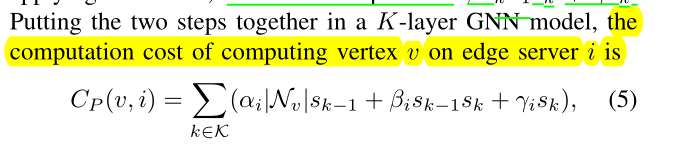

### Cross-edge traffic

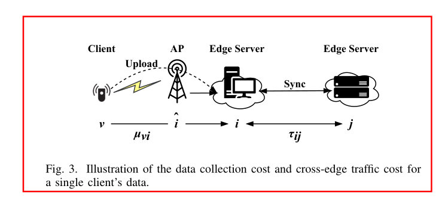

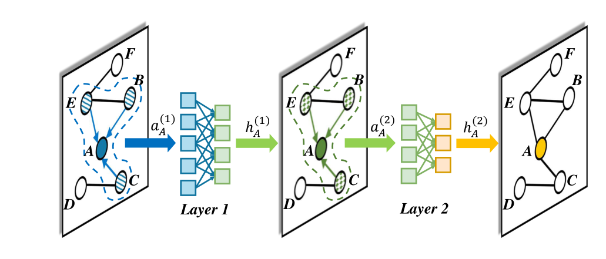

B’s feature vectors is ought to be sent to the edge server that A locates if A and B are placed at different servers, when computing vertex A’s embedding.（当A、B被存储在不同server上的开销）

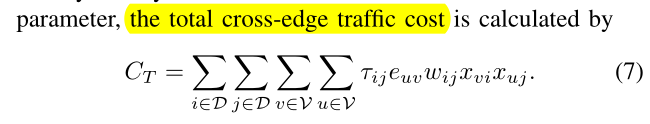

### Edge server maintenance

data-dependent cost:  such as the monetary cost for hosting the computing and storage resources

data-independent cost: one-shot expenditure like the cost of container launching and machine cooling.

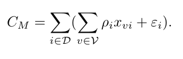

### Cost problem formulation

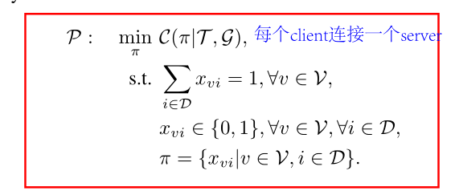

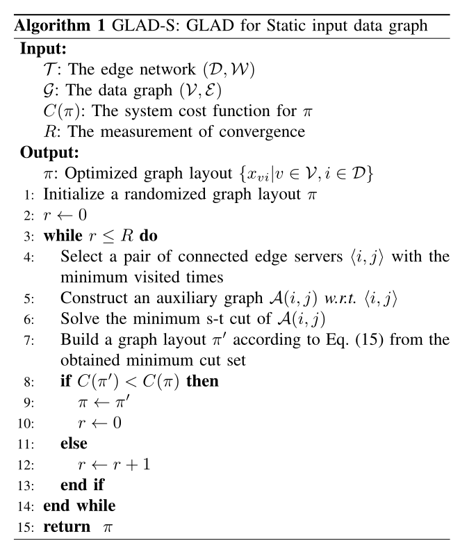