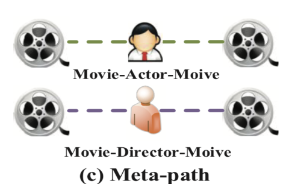
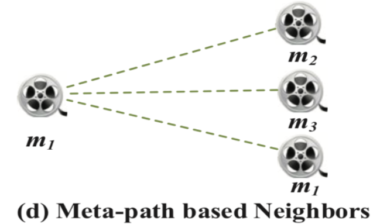
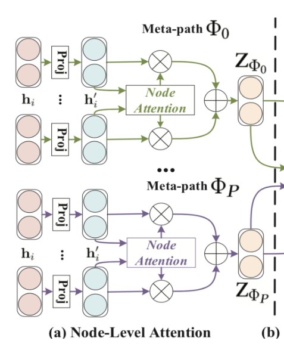
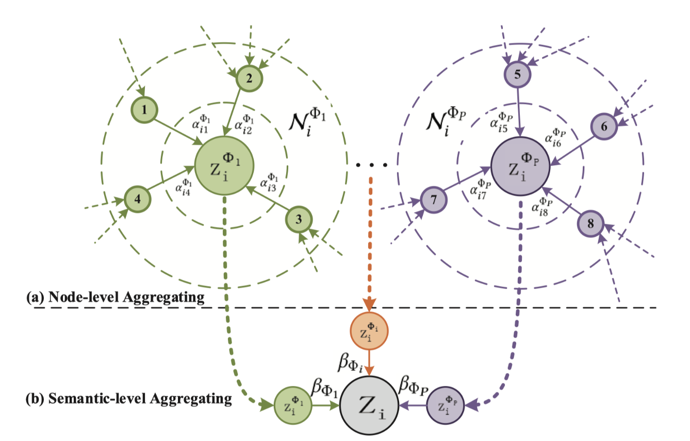
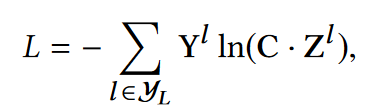
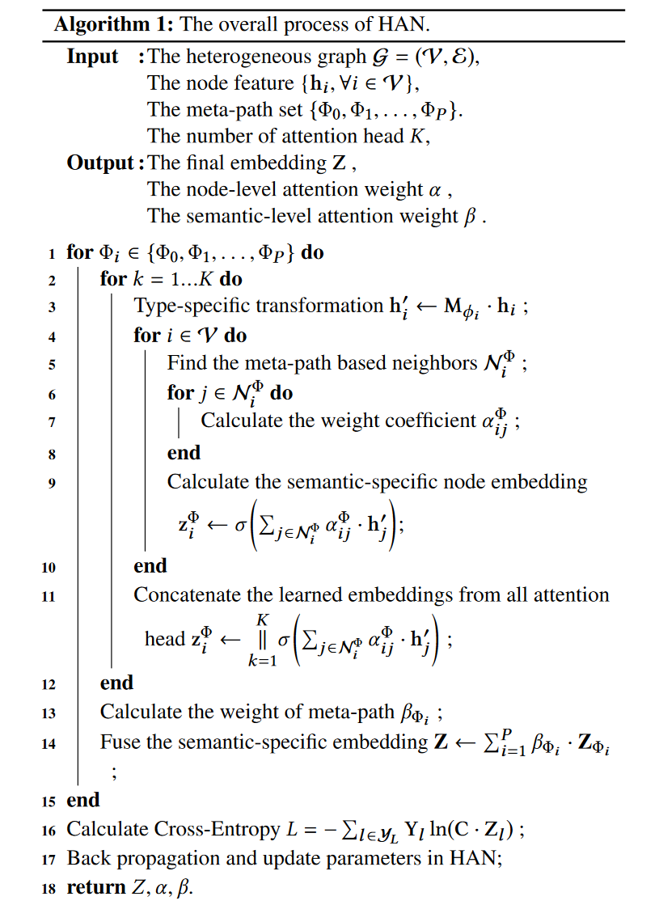

# Heterogeneous Graph Attention Network

propose a novel heterogeneous graph neural network based on the hierarchical attention, including **node-level and semantic-level attentions**.

## 两种attention

**Sematic-level attention**: 不同meta-path的权重

Semantic-level attention aims to learn the importance of each meta-path and assign proper weights to them.

eg: The Terminator can either connect to The Terminator 2 via Movie-Actor-Movie (both starred by Schwarzenegger) or connect to Birdy via Movie-Year-Movie (both shot in 1984). However, when identifying the genre of the movie The Terminator, MAM usually plays more important role, rather than MYM

**Node-level attention**：同一meta-path下不同邻居的权重

For each node, node-level attention aims to learn the importance of meta-path based neighbours and assign different attention values to them.

eg: using the meta-path Movie-Director-Moive (the movies are with the same director), The Terminator will connect to Titanic and The Terminator 2 via director James Cameron. To better identify the genre of The Terminator as sci-fi movie, the model should pay more attention to The Terminator 2, rather than Titanic

## Model

### Node-level attention

**Projection**

Use the node type specific transformation matrix to project the features of different types of nodes into the same feature space.
$$
\mathbf{h}_i^{\prime}=\mathbf{M}_{\phi_i} \cdot \mathbf{h}_i
$$
**Attention coefficient**

Calculate the attention coefficient for neighbour nodes $k \in \mathcal{N}_i^{\Phi}$
$$
\alpha_{i j}^{\Phi}=\operatorname{softmax}_j\left(e_{i j}^{\Phi}\right)=\frac{\exp \left(\sigma\left(\mathbf{a}_{\Phi}^{\mathrm{T}} \cdot\left[\mathbf{h}_i^{\prime} \| \mathbf{h}_j^{\prime}\right]\right)\right)}{\sum_{k \in \mathcal{N}_i^{\Phi}} \exp \left(\sigma\left(\mathbf{a}_{\Phi}^{\mathrm{T}} \cdot\left[\mathbf{h}_i^{\prime} \| \mathbf{h}_k^{\prime}\right]\right)\right)}
$$
where $σ$ denotes the activation function, $∥$ denotes the concatenate operation and $a_Φ$ is the node-level attention vector for meta-path $Φ$.

**node embedding**

The meta-path based embedding of node $i$ can be aggregated by the neighbour's projected features with the corresponding coefficients as follows:
$$
\mathrm{z}_i^{\Phi}=\sigma\left(\sum_{j \in \mathcal{N}_i^{\Phi}} \alpha_{i j}^{\Phi} \cdot \mathbf{h}_j^{\prime}\right)
$$

### Semantic-level attention

在得到不同meta-path的特征后，我们希望得到他们各自的权重$\beta$。
$$
\left(\beta_{\Phi_0}, \beta_{\Phi_1}, \ldots, \beta_{\Phi_P}\right)=\operatorname{att}_{s e m}\left(\mathbf{Z}_{\Phi_0}, \mathbf{Z}_{\Phi_1}, \ldots, \mathbf{Z}_{\Phi_P}\right)
$$
To learn the importance of each meta-path,  It first use a nonlinear transformation (e.g., one-layer MLP). Then use a semantic-level attention vector $q$, average the results of all nodes with meta path $\Phi$.
$$
w_{\Phi_i}=\frac{1}{|\mathcal{V}|} \sum_{i \in \mathcal{V}} \mathrm{q}^{\mathrm{T}} \cdot \tanh \left(\mathbf{W} \cdot \mathrm{z}_i^{\Phi}+\mathbf{b}\right)\\

\beta_{\Phi_i}=\frac{\exp \left(w_{\Phi_i}\right)}{\sum_{i=1}^P \exp \left(w_{\Phi_i}\right)}
$$
Fuse these semantic-specific embeddings to obtain the final embedding $Z$
$$
\mathbf{Z}=\sum_{i=1}^P \beta_{\Phi_i} \cdot \mathbf{Z}_{\Phi_i}
$$

### Loss

where $M$ is the parameter of the classifier, $Y^l$ is the set of node indices that have labels, $Y^l$ and $Z^l$ are the labels and embeddings of labelled nodes.

