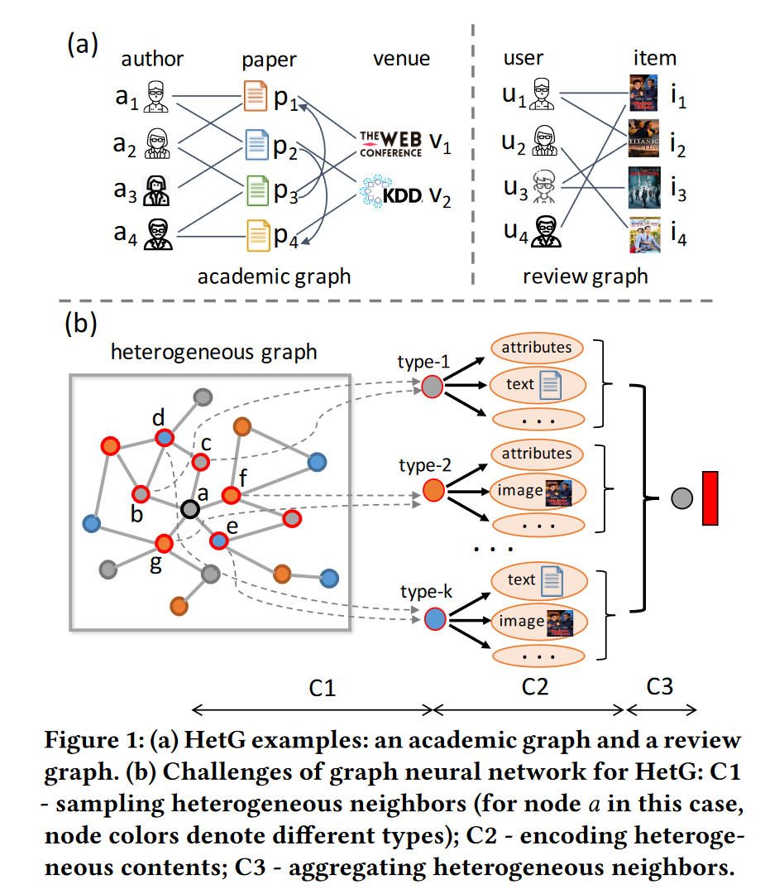
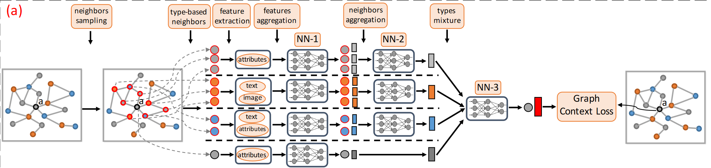
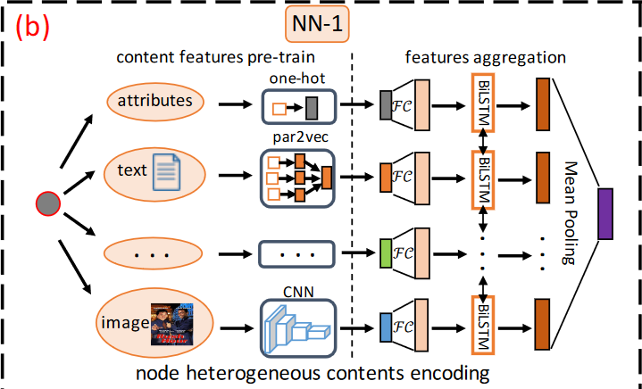
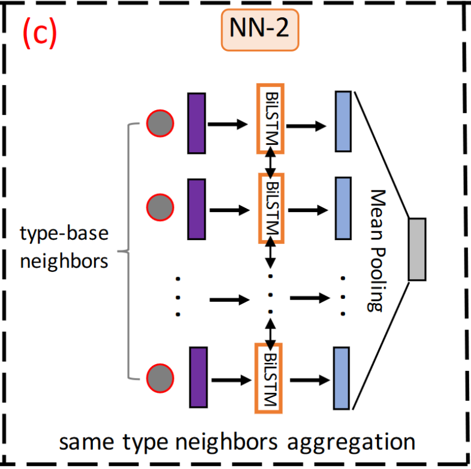
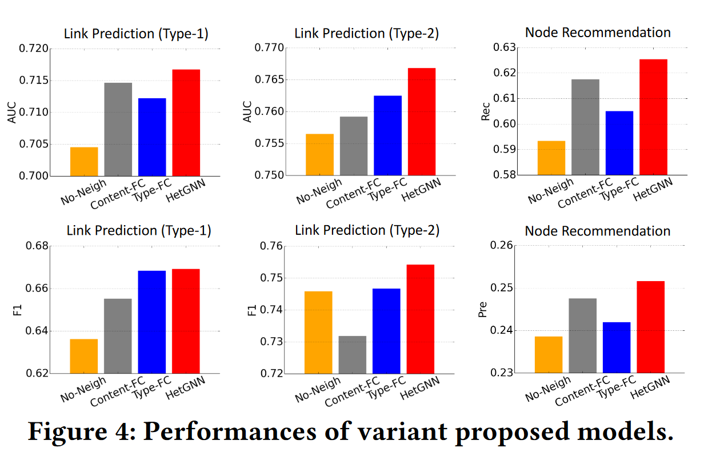

# HetGNN
REF: http://arxiv.org/abs/2003.01332
## Motivation

HetGNN面临的问题可以归纳成三点：

1. How to sample? 异质图中的大多数节点并不会连接所有类型的其他节点。如academic graph中user节点不会直接连到venue（论文）节点上。另外说节点能够连接的邻居数也不一样。大部分GNN直接聚合邻居（一阶）节点信息，而远处传过来的节点信息会随着距离而减弱。hub节点会被弱关联的邻居节点扰乱信息，冷启动的节点会因为邻居不足而导致不能充分表示。**那么问题1就是：如何对异质图上的每个节点采样到强相关的邻居节点呢？**
2. How to encode? 每个节点都带有非结构化的属性特征，如text、image，常用的从concatenate或者linear transformation不能建模节点属性间的deep interaction。**那么问题2就是：如何设计异质图上节点属性的encoder（编码器）来处理不同节点内容异质性问题。**
3. How to aggregate? 不同类型的邻居节点对生成节点embedding的贡献也不一样。例如在academic graph，author和paper节点对author的embedding的影响会强如venue，venue节点包含不同的主题，具有更一般的嵌入，而大部分gnn集中在同质图的处理上，也没有考虑这种不同类型节点的影响。 **挑战3是:如何通过考虑不同节点类型的影响来聚合异构邻居的特征信息。**

## Model

HetGNN consists of four parts:

1. sampling heterogeneous neighbours;
2. encoding node heterogeneous contents; 
3. aggregating heterogeneous neighbours; 
4. formulating the objective and designing model training procedure.

### Sampling Heterogeneous Neighbours

**Current problem for node’s direct (first-order) neighbours:**

* They cannot directly capture feature information from different types of neighbours.
  * HetGNN: 采样所有类型的邻居
* They are weakened by various neighbour sizes. 
  * HetGNN: 采样邻居数量固定
* They are not suitable for aggregating heterogeneous neighbours which have different content features.
  * HetGNN: 将不同类型的邻居进行分类

**Sample method for HetGNN: random walk with restart**

1. Sampling fixed length RWR. 从某一个节点开始随机游走（回到原点概率为$p$），直到采到每个种类的指定数目的邻居节点。
2. Grouping different types of neighbours. 对于类别$t$，选取最多被采样到的$k_t$个节点作为源节点的邻居。

### Encoding Heterogeneous Contents

HetGNN采用par2-vec处理text，采用CNN处理image，使用双向LSTM合并不同特征。

$$
f_1(v)=\frac{\sum_{i \in C_v}\left[\overrightarrow{\operatorname{LSTM}}\left\{\mathcal{F} C_{\theta_x}\left(\mathbf{x}_i\right)\right\} \bigoplus \overleftarrow{L S T M}\left\{\mathcal{F} C_{\theta_x}\left(\mathbf{x}_i\right)\right\}\right]}{\left|\mathcal{C}_v\right|}
$$
feature aggregation：

1. 首先用FC layer映射到同一特征空间
2. 再用Bi-LSTM to capture “deep” feature interactions and accumulate expression capability of all content features

### Aggregating Heterogeneous Neighbours

在得到不同节点的特征后，我们需要把邻居的特征聚合

1. same type neighbours aggregation 

2. types combination

#### same type neighbours aggregation 

通过以下公式聚合节点 $v$ 的类别 $t$ 的所有邻居的特征
$$
f_2^t(v)=\frac{\sum_{v^{\prime} \in N_t(v)}\left[\overrightarrow{L S T M}\left\{f_1\left(v^{\prime}\right)\right\} \bigoplus \overleftarrow{L S T M}\left\{f_1\left(v^{\prime}\right)\right\}\right]}{\left|N_t(v)\right|}
$$

#### types combination

对于节点 $v$ 来说，不同类别的邻居对其特征的贡献不同（attention）
$$
\mathcal{E}_v=\alpha^{v, v} f_1(v)+\sum_{t \in O_V} \alpha^{v, t} f_2^t(v)\\
\begin{gathered}
\mathcal{E}_v=\sum_{f_i \in \mathcal{F}(v)} \alpha^{v, i} f_i \\
\alpha^{v, i}=\frac{\exp \left\{\operatorname{LeakyReLU}\left(u^T\left[f_i \bigoplus f_1(v)\right]\right)\right\}}{\sum_{f_j \in \mathcal{F}(v)} \exp \left\{\operatorname{LeakyReLU}\left(u^T\left[f_j \bigoplus f_1(v)\right]\right)\right\}}
\end{gathered}
$$
where $LeakyReLU$ denotes leaky version of a Rectified Linear Unit, $u ∈ R^{2d×1}$ is the attention parameter.

### Objective and Model Training

还不太理解
$$
o_2=\sum_{\left\langle v, v_c, v_{c^{\prime}}\right\rangle \in T_{\text {walk }}} \log \sigma\left(\mathcal{E}_{v_c} \cdot \mathcal{E}_v\right)+\log \sigma\left(-\mathcal{E}_{v_{c^{\prime}}} \cdot \mathcal{E}_v\right)
$$

## Experiments

* No-Neigh that uses heterogeneous contents encoding to represent each node embedding (without neighbors information);
  * 不考虑邻居，只做encoding
* Content-FC that employs a fully connected neural network (FC) to encode node heterogeneous contents; 
  * 将Bi-LSTM替换成FC
* Type-FC that utilizes a FC to combine embeddings of different neighbor types
  * 不使用attention对邻居节点特征进行加权，直接用FC layer
