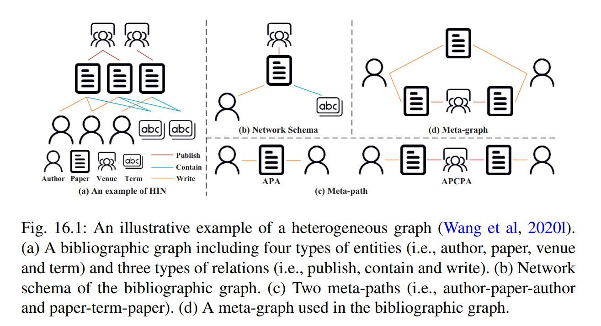

# Heterogeneous Graph Neural Network

**注：Meta Path 是一条包含relation序列的路径，而这些 relation 定义在不同类型object之间**

Heterogeneous graphs (HGs) are composed of different types of entities and relations

## 研究现状

### heterogeneous graph embedding

aiming to learn a function that maps input space into lower-dimensional space while preserving heterogeneous structure and semantic

**specific in HG**

1. Semantic dependent graph structure, e.g., meta-path structure can be very different when considering different types of relations; （如何定义异质图）
2. different types of nodes and edges have different attributes located in different feature spaces;（不同类型的节点和边怎么定义特征、初始化）
3. Application dependent, need sufficient domain knowledge for meta-path/meta-graph selection

* Shallow models

* Deep models

  * message-passing based
  * encoder-decoder based
  * adversarial based

  

## Basic Concept

**heterogeneous graph Definition**

A HG is defned as a graph $G = \{V ,E \}$, in which $V$ and $E$ represent the node set and the edge set. 

Each node $v ∈ V$ and each edge $e ∈ E$ are associated with their mapping function $φ(v) : V → A$ and $ϕ(e) : E → R$. $A$ and $R$ denote the node type set and edge type set, respectively, where $|A |+|R| > 2.$

**Meta-path Definition**

A meta-path $p$ is based on network schema $S$ 

with node types $N_1,N_2,··· ,N_{l+1} ∈ N$ and edge types $R_1,R_2,···R_l ∈ R$

For example, the meta-path **APA** indicates the co-author relationship and **APCPA** represents the co-conference relation

**Meta-graph Definition**

A directed acyclic graph (DAG) composed of multiple meta-paths with common nodes. Formally, meta-graph is defned as $T = (V_T ,E_T )$, where $V_T$ is a set of nodes and $E_T$ is a set of edges. For any node $v ∈ V_T ,φ(v) ∈ A$ ; for any edge $e ∈ E_T ,ϕ(e) ∈ R$.

**Heterogeneous Graph Embedding Definition**

Heterogeneous graph embedding aims to learn a function $Φ : V → R^d$ that embeds the nodes $v ∈ V$ in HG into low-dimensional Euclidean space with $d ≪ |V |$

## Message Passing-based Methods (HGNNs)

### [HetGNN介绍](./HetGNN.md)

### [HAN介绍](./HAN.md)
