# Link prediction in GNN

Application:

* social network friend recommendation
* co-authorship prediction in citation network
* movie recommendation in Netflix
* protein interaction prediction in biological networks

Two popular GNN-based link prediction paradigms

* Node-based
  * Learn node representation through a GNN 
  * aggregate the pairwise node representations as link representations
* Subgraph-based
  * extract a local subgraph around each target link, and then apply a graph-level GNN (with pooling) to each subgraph to learn a subgraph representation

## Traditional methods

### Local heuristics

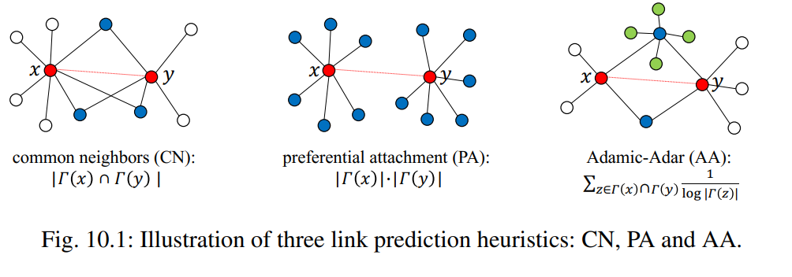

$\Gamma(x)$ to denote the set of $x$’s neighbors

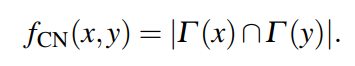

考虑节点间相同邻居的数量

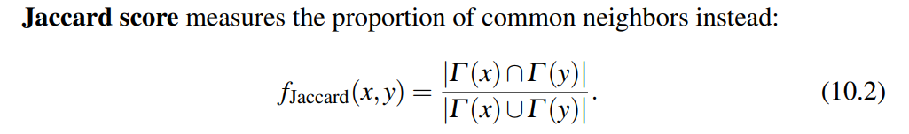

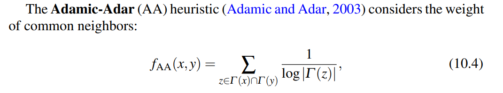

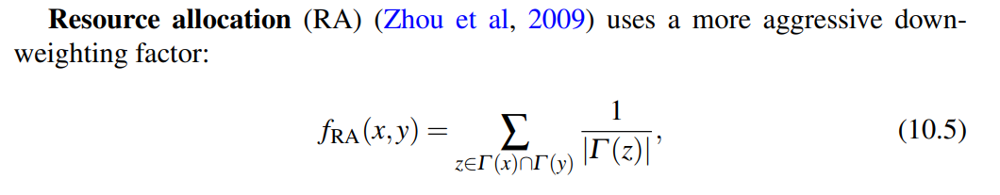

节点的度越高，权重越低，两个节点的相连可能性低

### Global Heuristics

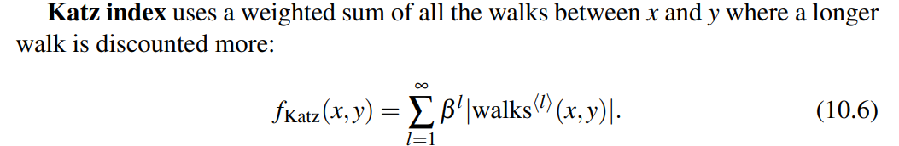

计算两节点间不同长度路径的数量之和，长度越长权重越小

## GNN-based

### GAE: Graph-AutoEncoder

自监督的训练，训练网络来预测图中原有的边，进而预测

Given the adjacency matrix $A$ and node feature matrix $X$

For each i,j , output a probability for link $(i,j)$

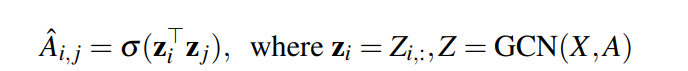

consider $A_{i,j}=\{0,1\}$

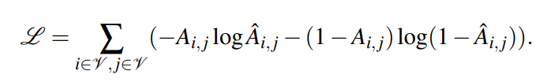

### VGAE: Variational Graph auto-encoder

[VGAE（Variational graph auto-encoders）论文详解 - 知乎 (zhihu.com)](https://zhuanlan.zhihu.com/p/78340397)

[VGAE：图变分自编码器 - 知乎 (zhihu.com)](https://zhuanlan.zhihu.com/p/345337636)

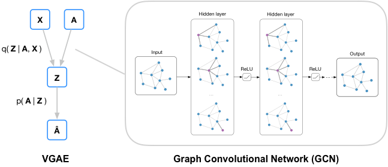

#### 编码器

定义了一个后验概率

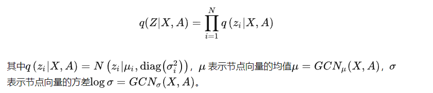

编码器为两层图卷积网络，得到每个节点的向量$z_i$

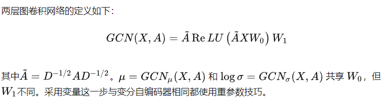

#### 解码器

解码器计算图中任意两点之间存在边的概率来重构图：

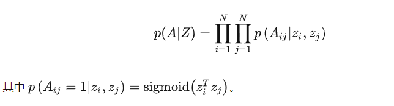

损失函数包括似然期望（越大），以及节点表示向量分布和正态分布的KL散度（越小）两部分：

[Variational Autoencoder（变分自编码 VAE，CVAE）](https://blog.csdn.net/qq_39388410/article/details/79129197)

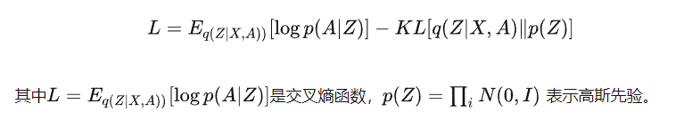